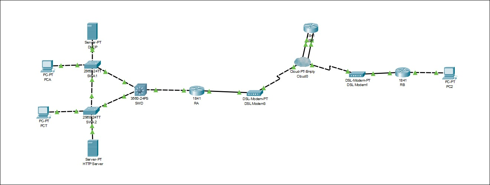

# Network Topologgy using Cisco Packet Tracer
Cisco Packet Tracer is a cross platform software designed by Cisco Systems that allow users to create network topologies and imitate modern computer Networks. It uses a command line interface in order to simulate the configuration of Cisco routers and devices. 

## Topology Created in this Scenario

 Figure No 1.1: Network Topology

